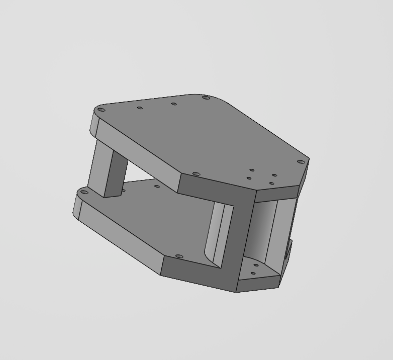

<p align="center">
  
</p>

<h1 align="center">SURGE-090 · Smart Snake Robot 🐍</h1>

<p align="center">
  <b>SURGE Summer Research Programme · Indian Institute of Technology Delhi · 2026</b>
</p>

<p align="center">
  <a href="#abstract">Abstract</a> •
  <a href="#project-status">Status</a> •
  <a href="#the-two-generations">Generations</a> •
  <a href="#system-architecture">Architecture</a> •
  <a href="#repository-structure">Structure</a> •
  <a href="#quick-start">Quick Start</a> •
  <a href="#team">Team</a>
</p>

---

## Abstract

**SURGE-090** is a ten-degree-of-freedom, bio-inspired snake robot intended for locomotion in unstructured and confined environments. It propels itself by **sinusoidal lateral undulation**, and its central research contribution is **sensorless collision detection**: motor current is monitored continuously, and a stall-current spike is used as a tactile obstacle signal, removing the need for any external proximity or force sensor.

The project was carried out under the **SURGE (Summer Undergraduate Research Grant for Excellence)** programme at **IIT Delhi** in summer 2026, on a ₹1,00,000 grant. It passed through two hardware generations, and the transition between them is the central event in the project's history — see [Why there are two generations](#why-there-are-two-generations).

> **This README is a research log, not a product page.** Every subsystem below is tagged with its real state. Where something is designed but not built, it says so.

---

## Project Status

**Overall: design and simulation complete; no integrated hardware build.** The project reached Phase 2 of a planned 8 phases.

| Subsystem | State | Notes |
|---|---|---|
| Serpenoid gait generator (Python) | 🟢 **Implemented** | Sound math; run against 2 motors only, never 10 |
| Current-threshold collision detection | 🟡 **Implemented, uncalibrated** | 350 mA is an estimate, not a measurement |
| Evasion state machine | 🟢 **Implemented** | Robot is blind for the full 6.5 s evasion window |
| Side-aware turn direction | 🔴 **Implemented but unsound** | See [Known Issues](#known-issues) — no physical basis |
| Dynamixel XL330 bus driver | 🟡 **Written, partially exercised** | Verified against **2** motors; 10-motor path never ran |
| ESP32 gait simulation (Wokwi) | 🟢 **Working** | 5 PWM servos, in-browser only |
| Body segment CAD — v1/v2 (SolidWorks) | 🟢 **Printed** | 2 segments printed and measured |
| Body segment CAD — v4 (CadQuery) | 🟢 **Complete, not printed** | Sound; the design to build from |
| Body segment CAD — v5 (CadQuery) | 🔴 **Broken** | Dimensional error; do not print. See [Known Issues](#known-issues) |
| v2.0 electrical architecture | 🟢 **Specified** | Full safety architecture, wiring, pin maps |
| ST3215 servo driver | 🔴 **Not implemented** | Exists only as listings inside the LaTeX report |
| ESP32 robot firmware (CPG, IMU fusion) | 🔴 **Not implemented** | No `.ino` outside the Wokwi PWM demo |
| ESP-NOW telemetry link | 🔴 **Not implemented** | Listing has a placeholder MAC and dummy payload |
| Base-station ROS 2 / web UI / IK | 🔴 **Not implemented** | Named in the report; no code |
| Friction-anisotropy hardware | 🔴 **Not built** | Load-bearing for the gait — see below |
| Assembled 10-DOF robot | 🔴 **Not built** | — |

### The hardware blocker

**Only 2 of the 10 planned Dynamixel XL330-M288-T motors were ever obtained**, after which the part became unavailable in the Indian market. Of the ₹1,00,000 grant, **≈₹33,760 was spent**. The entire 10-motor control stack in `src/` was therefore written against hardware that did not exist, and the 10-motor loop in `main.py` has never executed.

The only recorded instance of this codebase moving a physical actuator is an **SG90 hobby servo on Raspberry Pi GPIO 13**, via the now-deprecated `servo_test.py`.

### The unresolved physics problem

`snake_locomotion.py` generates a planar undulation that produces thrust **only if the belly has anisotropic friction** — low resistance sliding forward, high resistance sliding backward. That hardware was never fitted. Without it, the correct prediction for this robot is that it *undulates in place without translating*.

The v4/v5 CAD addresses this with sawtooth belly scales (5.0 mm pitch, 2.0 mm depth, ramp forward / cliff backward), which is the right answer — but no segment carrying them has been printed. **This is the single most important open item in the project.**

---

## Why there are two generations

The redesign was **forced by component supply, not chosen on engineering grounds.** The commit that opens generation 2 records it plainly:

```
a32b675  2026-08-20  "No dynamixel in the market. So switched to Servos"
```

After a six-week stall waiting on motors that were not going to arrive, the architecture was rebuilt around **Waveshare ST3215** serial bus servos, which are readily sourced in India and carry substantially more torque. The move brought genuine secondary benefits — roughly 5.7× the joint torque, and a 12 V rail that supports a larger robot — but those are consequences of the switch, not the reason for it.

Being straightforward about this matters: a re-architecture under a procurement constraint is a legitimate engineering result. Presenting it as a torque-driven design decision would invite the question of where the torque budget is — and there isn't one yet.

---

## The Two Generations

### `gen1-dynamixel/` — original design

| Aspect | Detail |
|---|---|
| **Motors** | 10× ROBOTIS Dynamixel XL330-M288-T (0.52 N·m, 1.5 A stall @ 5 V) — **2 obtained** |
| **Interface** | ROBOTIS U2D2 + Power Hub Board, TTL daisy chain, Protocol 2.0 |
| **Compute** | Raspberry Pi (4 in BOM, 5 used in lab), Python + `dynamixel-sdk` |
| **Power** | 5 V / 10 A SMPS, tethered |
| **Encoder** | 12-bit magnetic absolute, 0.088°/step |
| **Status** | Control stack written; 2-motor bench only |

### `gen2-st3215/` — ST3215 + ESP32 redesign

| Aspect | Detail |
|---|---|
| **Motors** | 10× Waveshare ST3215 (2.94 N·m / 30 kg·cm, 2.7 A stall @ 12 V) — **0 obtained** |
| **Interface** | Waveshare Bus Servo Adapter (A), Feetech SCS half-duplex TTL @ 1 Mbps |
| **Onboard compute** | ESP32 dev board — *specified*, firmware not written |
| **Base station** | Raspberry Pi 5 + second ESP32 as radio bridge — *specified* |
| **Wireless** | ESP-NOW 2.4 GHz peer-to-peer, <10 ms — *specified* |
| **Sensors** | MPU6050 IMU (I²C 0x68), HC-SR04**P** ultrasonic (3.3 V-safe) |
| **Power** | 2× Orange 3S 1500 mAh 30C LiPo → 12 V servo rail; Mini560 buck → 5 V logic |
| **Status** | Electrical design and CAD complete; **no code, no hardware** |

> ⚠️ **HC-SR04P only.** A standard HC-SR04 drives its ECHO pin at 5 V and will permanently damage the ESP32 input stage.

### Corrected v2.0 power figures

The LaTeX report's discharge numbers are double-counted. The correct values from its own per-pack data:

| Quantity | Report says | Actual |
|---|---|---|
| Continuous discharge | 180 A | **90 A** (2 × 45 A) |
| 10 s burst | 270 A | **150 A** (2 × 75 A) |
| Effective ceiling | — | **30 A** — limited by 2× 15 A pack fuses |
| Worst-case load (10 servos stalled) | 27 A | 27 A — **90% of fuse rating** |
| Estimated runtime | *not stated* | **≈12–18 min** at 10–15 A draw |

Capacity is 3000 mAh at 11.1 V nominal = **33.3 Wh**. There is currently **no mass budget and no torque budget** — both are required before a physical build.

---

## System Architecture

### v1.0 — Dynamixel (as built, 2 motors)

```
┌────────────────────────────────────────────┐
│              Raspberry Pi                  │
│  main.py ──── control loop (see note)      │
│     ├──► src/obstacle_avoidance.py         │
│     │        current threshold + FSM       │
│     ├──► src/snake_locomotion.py           │
│     │        travelling sine wave          │
│     └──► dynamixel-sdk                     │
│            write4ByteTxRx  (goal position) │
│            read2ByteTxRx   (present current)│
└──────────────┬─────────────────────────────┘
        │ USB
   ┌────┴─────┐
   │ U2D2+PHB │  5 V power injection
   └────┬─────┘
        │ X3P TTL daisy chain
┌───────▼────────────────────────────────────┐
│  Motor 1 → 2 → … → 10   (only 1–2 existed) │
└────────────────────────────────────────────┘
```

> **Note on loop rate:** `main.py` performs **20 blocking serial round-trips per iteration** (10 reads + 10 writes, individually) at 57600 baud ≈ 94 ms of wire time, then adds an *additive* 20 ms sleep. Real rate is **under 10 Hz**, not the 50 Hz implied by `Config.CONTROL_HZ`. Collapsing these into `SyncRead`/`SyncWrite` and raising the baud rate is the fix; `servo_driver.py`'s own docstring says as much.

### v2.0 — ST3215 + ESP-NOW (specified only)

```
  ┌─── BASE STATION ────────────────────────────┐
  │  Raspberry Pi 5   telemetry / planning      │
  │       ↕ USB-UART                            │
  │  ESP32 #2         ESP-NOW radio bridge      │
  └──────────────┬──────────────────────────────┘
                 │  ESP-NOW 2.4 GHz  (telemetry only —
                 │  no downlink command path exists)
  ┌──────────────▼──────────────────────────────┐
  │  ESP32 #1   onboard: gait · IMU · obstacle  │
  │       ↕ UART2  GPIO17→RX  GPIO16→TX  1 Mbps │
  │  Waveshare Bus Servo Adapter (A)            │
  └──────────────┬──────────────────────────────┘
                 │  3-pin bus daisy chain
  ┌──────────────▼──────────────────────────────┐
  │  ST3215 #1 → #2 → … → #10                   │
  └─────────────────────────────────────────────┘
      ⏚ 2× 3S LiPo →[15 A fuse each]→ XT60 Y
        → loop key → 12 V rail → Mini560 → 5 V
```

> The wiring SVG and the LaTeX report give **opposite TX/RX pairings** for the ESP32↔adapter link. One is wrong; resolve before wiring. The SVG's own advice applies: *"if silent, swap TX/RX."*

### Evasion state machine

```
SLITHER ──(any |I| > 350 mA)──► SLITHER_REV (2.5 s)
                                    │
                                    ▼
                             SLITHER_TURN (4.0 s)
                                    │
                                    ▼
                                 SLITHER
```

Detection is suppressed while in `SLITHER_REV` and `SLITHER_TURN`, so the robot cannot detect a second obstacle for the full **6.5 s** manoeuvre.

---

## Gait Parameters

⚠️ These live as instance attributes in **`src/snake_locomotion.py`**, *not* in `robot_config.py`. The four numbers that actually determine how the robot walks are the four that are not in the config file.

```python
wave_phase = (wave_dir * self.frequency * current_time) - (i * self.phase_shift)
pos = int(self.center_pos + self.amplitude * math.sin(wave_phase) + bend)
```

| Parameter | Value | Physical meaning |
|---|---|---|
| `amplitude` | 400 ticks | **35.2°** peak joint deflection |
| `frequency` | 3.0 rad/s | **0.477 Hz** gait cycle (period 2.09 s) |
| `phase_shift` | 1.2 rad | per motor *index* — **2.4 rad** between adjacent *driven* joints |
| `turn_offset` | 300 ticks | **26.4°** uniform spine bias when turning |
| — | — | 5 driven joints → **≈1.53 wavelengths** along the body |

**Only 5 of the 10 joints move.** Even-indexed (pitch) joints are held at `ENCODER_CENTER = 2048` permanently, so the gait is planar. The v4/v5 CAD is an all-yaw planar chain in any case, which makes the pitch half redundant in the v2.0 mechanical design.

Constants that *are* in `src/robot_config.py`: `NUM_JOINTS = 10`, `ENCODER_CENTER = 2048`, `BAUDRATE = 57600`, `OBSTACLE_CURRENT_THRESHOLD_MA = 350`, `EVASION_REVERSE_DURATION_S = 2.5`, `EVASION_TURN_DURATION_S = 4.0`, `MAX_TORQUE_NM = 0.52`. Note that 16 of the 27 entries in `Config` are consumed only by unused modules or by nothing at all.

---

## Known Issues

Ordered by how much they matter. Fix the first two before anything else.

1. **Plaintext SSH credentials are committed** in `docs/SSH_LOGIN_INSTRUCTIONS.md` in a public repository. Rotate the Raspberry Pi password and purge it from the file. (History rewriting is optional; rotating the credential is not.)
2. **`CAD/segment_designs/v5/segment_v5.py` is dimensionally wrong.** It sets `M_WID = 37.80`, which is the ST3215's *height*, not its width — the same file uses 37.80 as `HORN_Z`. The manufacturer drawing in this repo (`CAD/ST3215_2D/ST3215.pdf`, DWG "SCS215") gives the envelope as **45.22 × 24.72 × 37.25 mm**. Consequence: cradle sidewalls fall from v4's 3.74 mm to **0.20 mm** — thinner than one extrusion. v5 is larger than v4 in every bounding dimension yet contains 13% less material (22,061 vs 25,407 mm³). **Fix:** restore `M_WID = 24.72` and `W_HALF = 16.5`. Until then, **v4 is the design of record.**
3. **`2.0 - Servo/README.md` is a verbatim copy of the v1.0 README**, describing a Dynamixel architecture, with links to files that exist only in `1.0 - Dynamixel/`.
4. **The v2.0 `src/` tree is byte-identical to v1.0's** — `diff -r` returns zero differences. It still imports `dynamixel_sdk`, speaks ROBOTIS Protocol 2.0 at 57600 baud, and uses XL330 register addresses (64/116/126/132) where the ST3215 uses a different map entirely. Most consequential single leftover: `OBSTACLE_CURRENT_THRESHOLD_MA = 350`, calibrated to a motor with ~70 mA free-run current, on a servo that stalls at 2.7 A.
5. **"Side-aware turning" has no physical basis.** It takes the *sign* of `PRESENT_CURRENT`, which reports torque direction, not which side an obstacle is on. Under sinusoidal gait that sign flips every half cycle (~1.05 s) regardless of obstacles, so evasion direction is effectively random. Genuine side-awareness needs either two sensors or comparison of *which* joint stalled against its commanded phase.
6. **Three of the seven documented modules are dead code** — `kinematics.py`, `torque_controller.py`, and `servo_driver.py` are never imported by anything. (`main.py`'s local variable `kinematics` is a `SnakeKinematics` from `snake_locomotion.py`, not the `Kinematics` class.) Additionally, `kinematics.py` contains order-of-magnitude errors: peak amplitude works out to 2.2° against the 35.2° the working gait uses, and `K_S = 1.0` rad/m implies a 6.28 m wavelength on a 0.76 m robot — i.e. all joints in phase, no undulation.
7. **`main.py` cannot run without hardware.** It imports the SDK at module scope and opens the port immediately; there is no `--mock` flag, and `servo_driver.py`'s mock backend — whose `connect()` returns `True` and prints "Successfully connected to servos" *without opening a port* — is not wired to anything.
8. **Documentation carries three mutually inconsistent architectures**: Pi + U2D2 + XL330 (`wiring_diagram.md`), Pi-onboard + ST3215 (`general procedure.png`), and ESP32 + ESP-NOW + ST3215 (`snake_robot_wiring_diagram.svg`, LaTeX report). The last is the intended one.
9. **`parts_and_safety.md` warns "NEVER exceed 6.0 V"** inside a generation whose servo rail is 12 V. Correct for XL330, dangerously misleading for ST3215.
10. **The ST3215 ID-assignment routine omits the EEPROM unlock** (register `0x37`) that its own surrounding prose claims to perform. ST3215 EEPROM ships locked, so ID writes will be silently rejected on a virgin servo. The routine is also write-only — it never reads a reply, despite the procedure calling for ping verification.
11. **Repository hygiene:** `.git` is 280 MB against a 351 MB working tree; **38 file pairs are byte-identical duplicates** across the two generations (including two copies of a 21 MB screen recording); `CAD/Assembly.step` is not an assembly — it is a byte-identical copy of `segments/segment1.STEP`; PowerPoint `~$…pptx` lock files are committed in both generations; the LaTeX *source* for the electrical report is untracked while its build artifacts sit in the working tree; there is no `.gitignore` and no Git LFS configuration.
12. **Budget figures do not reconcile.** ₹52,500 was previously reported; the source table sums to ₹58,000; actual spend was ₹33,760 — on 2 motors, at unit prices up to 2.2× the estimates (Raspberry Pi 4: ₹11,149 actual vs ₹5,500 planned). A genuine 10-motor build prices near **₹85–90k** of the ₹1,00,000 grant, so the earlier "significantly under budget" characterisation does not hold.

---

## Repository Structure

```
surge090/
├── README.md                          ← you are here
├── ISSUES.md                          # known issues tracker
├── MIGRATION.md                       # reorganisation log
├── .gitignore                         # untracked files pattern list
├── .gitattributes                     # binary/LFS attributes
│
├── gen1-dynamixel/                    ══ GENERATION 1 ══════════════
│   ├── main.py                        # entry point, 10-motor loop
│   ├── requirements.txt               # dependencies
│   ├── install_requirements.cmd       # dependency installation helper
│   ├── src/                           # control modules (Dynamixel)
│   ├── tests/                         # Dynamixel test scripts
│   ├── cad/                           # CAD model files
│   │   ├── segments/                  # 3D printable segments
│   │   ├── assembly/                  # CAD assembly
│   │   └── motor-ref/                 # motor reference models
│   ├── hardware/                      # BOM.xlsx, Dynamixel_Selection.md
│   ├── docs/                          # reports, setups, presentations
│   └── media/                         # images and videos
│
├── gen2-st3215/                       ══ GENERATION 2 ══════════════
│   ├── PORTING_STATUS.md              # porting guidance
│   ├── main.py                        # identical to gen1 main.py
│   ├── requirements.txt               # identical to gen1 requirements.txt
│   ├── install_requirements.cmd       # identical to gen1 cmd
│   ├── servo_test.py                  # deprecated servo test code
│   ├── src/                           # identical to gen1 src
│   ├── tests/                         # identical to gen1 tests
│   ├── cad/                           # Waveshare ST3215 models
│   │   ├── motor-ref/                 # drawing, step, and dxf
│   │   └── segments/                  # v4 (stable) and v5 (corrected)
│   ├── docs/                          # gen2-only documentation
│   ├── progress/                      # LaTeX progress reports
│   └── media/                         # gen2 images
│
├── simulation/wokwi/                  # shared Wokwi simulation
│
└── tools/
    └── reorganise.ps1                 # restructuring script
```

---

## Quick Start

> Applies to **generation 1 only**, and requires real Dynamixel hardware. There is no simulation or mock path in the Python stack. Generation 2 has no runnable servo code.

**Prerequisites:** Python 3.8+, ROBOTIS U2D2 over USB, at least one XL330 motor.

```bash
git clone https://github.com/shashankjangir/surge090.git
cd "surge090/gen1-dynamixel"
pip install -r requirements.txt          # or: install_requirements.cmd
```

Set the serial port in `main.py`, `tests/test_dynamixel_ping.py`, and `tests/test_motor_feedback.py` — it is hardcoded in all three:

```python
DEVICENAME = 'COM3'          # Windows
DEVICENAME = '/dev/ttyUSB0'  # Linux / Raspberry Pi
```

Assign unique motor IDs 1–10, one motor at a time, using **Dynamixel Wizard 2.0**. All motors ship as ID 1.

```bash
python tests/test_dynamixel_ping.py     # expect [MISSING] for absent IDs
python tests/test_motor_feedback.py     # live position / velocity / current
python main.py                          # Ctrl+C disables all torques cleanly
```

**Before running `main.py` on a real chain:** use `test_motor_feedback.py` to record actual free-run and stall currents, then set `OBSTACLE_CURRENT_THRESHOLD_MA` from measurement. The committed 350 mA is an estimate and has never been validated.

### ESP32 simulation (no hardware required)

The one part of the project you can exercise today: **[wokwi.com/projects/467623718124707841](https://wokwi.com/projects/467623718124707841)**

Five PWM servos, HC-SR04, MPU6050 and an SSD1306 OLED. Better engineered than the Python stack in several respects — exponential distance smoothing (α = 0.4), obstacle hysteresis (trips at 20 cm, clears at 25 cm), IMU flip detection, graceful degradation if the OLED or IMU is absent, and a live serial tuning console (`f b l r s a | A# S# W# T# C# | ?`) at 115200 baud. Note its gait tuning (40°, 0.95 Hz, ≈0.51 wavelength) was never reconciled with the Python side's (35.2°, 0.477 Hz, ≈1.53 wavelengths).

---

## What This Project Actually Contributes

Worth stating plainly, because it is real and it is not the same as "a working robot":

**Actuator trade study** — `gen1-dynamixel/hardware/Dynamixel_Selection.md` argues SG90 vs AX-12A vs XL330 with reasoned rejections rather than assertions. SG90 is ruled out precisely because it reports no current, which would eliminate the project's central premise. AX-12A is ruled out on mass (540 g across 10 joints) and on requiring a separate 12 V rail. Daisy-chaining is justified on cable mechanics, not convenience.

**A mechanical load-path insight** — v4's CAD identifies that a bus servo's case screws are for fixed mounting only, so in a chained module **only the horn and rear-hub bolt circles transmit load**. Hence the double-shear yoke, bolted at both `HORN_Z` and `HUB_Z − PLATE_T`, with the segment acting purely as a cradle. Credited to ACM-R5 and CMU designs. 58 mm joint pitch; identical chained parts place every shaft axis on one line; 11 segments ≈ 638 mm.

**An electrical safety architecture** — five layers, each with a stated reason: per-pack 15 A fuses placed *upstream* of the Y-junction specifically so a cell short cannot reverse-charge the other pack; XT60 loop key as spark-safe master disconnect; balance-port low-voltage buzzers at ≤3.4 V/cell; a 1000 µF 25 V low-ESR bulk capacitor to absorb servo-reversal transients; logic isolation via the Mini560. The first power-up procedure includes a >10 MΩ rail-to-ground insulation check with an explicit halt condition, and the HC-SR04P trap is caught before any hardware existed.

**A working gait formulation** — 35.2° amplitude, 2.4 rad between driven joints, ≈1.53 wavelengths, with correct wave reversal for backward travel.

---

## Documentation

| Document | Path |
|---|---|
| Motor trade study | [`hardware/Dynamixel_Selection.md`](gen1-dynamixel/hardware/Dynamixel_Selection.md) |
| Hardware BOM | [`docs/reports/hardware_bom.md`](gen1-dynamixel/docs/reports/hardware_bom.md) |
| Starter kit manual | [`docs/reports/starter_kit_manual.md`](gen1-dynamixel/docs/reports/starter_kit_manual.md) |
| Parts & safety (⚠ XL330-era, 6 V warning) | [`docs/parts_and_safety.md`](gen1-dynamixel/docs/parts_and_safety.md) |
| Raspberry Pi setup | [`docs/raspberry_pi_setup_guide.md`](gen1-dynamixel/docs/raspberry_pi_setup_guide.md) |
| Progress review deck (25%) | [`docs/presentations/`](gen1-dynamixel/docs/presentations/) |
| **v2.0 wiring diagram (SVG)** | [`docs/snake_robot_wiring_diagram.svg`](gen2-st3215/docs/snake_robot_wiring_diagram.svg) |
| **v2.0 electrical system report** | [`progress/electrical_system_report.pdf`](gen2-st3215/progress/electrical_system_report.pdf) |
| Additional parts & pricing | [`docs/additional_parts_spreadsheet.md`](gen2-st3215/docs/additional_parts_spreadsheet.md) |
| ST3215 manufacturer drawing | [`cad/motor-ref/ST3215.pdf`](gen2-st3215/cad/motor-ref/ST3215.pdf) |
| Wokwi simulation notes | [`simulation/wokwi/README.md`](simulation/wokwi/README.md) |

---

## Roadmap

**Immediate — before any further build**

1. Rotate the committed SSH credential; purge it from tracked docs.
2. Restore `M_WID = 24.72` / `W_HALF = 16.5` in `segment_v5.py`; re-export STEP and STL.
3. Print one v4 segment with belly scales. Measure the forward/backward friction ratio on the intended surface. **This decides whether the concept works at all.**
4. Write the torque and mass budgets that the ST3215 selection is supposed to rest on.

**Then**

5. Port `robot_config.py` to the ST3215 register map and 1 Mbps; re-derive the current threshold from measurement.
6. Add a `--mock` path so gait work no longer needs hardware.
7. Replace per-motor reads/writes with `SyncRead`/`SyncWrite` to reach a real 50 Hz.
8. Replace current-sign turn selection with something physically grounded.
9. Build the two-segment articulated joint test bench, then extend to 10.

---

## Team

**SURGE-090 — Smart Snake Robot** · IIT Delhi · Summer 2026
Supervisor: **Prof. Amartansh Dubey**

| Member | Entry No. | Role |
|---|---|---|
| Shashank Jangir | 2024EE11048 | Project lead · hardware · CAD · Electronics |
| Bhavesh Bansiwal | 2024ME10487 | software · mechanical . CAD |
| Mahima Chotiya | 2024ME11187 | Mathematics . physics |

---

## Acknowledgements

Carried out under the **SURGE (Summer Undergraduate Research Grant for Excellence)** programme at **IIT Delhi**. We thank our supervisor and the Department of Mechanical Engineering for their guidance and laboratory resources.

---

## License

© 2026 SURGE-090 Team, IIT Delhi. All rights reserved.
Shared for academic and research purposes only.
