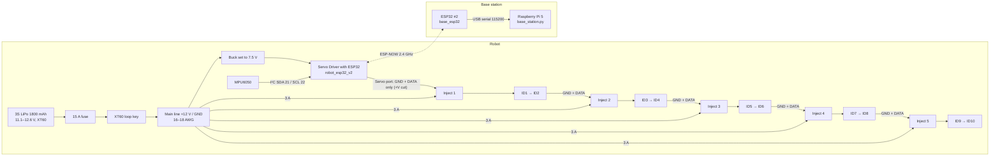

# SURGE-090 Wiring & Circuit Diagram — Gen 2 (ST3215, split power bus v3)

> **Updated 24 Sep 2026.** What we did before and what we do now is recorded in [What changed](#what-changed) at the end of this file.

This is the current wiring for the Gen 2 robot: 10× Waveshare ST3215 servos, one
Waveshare Servo Driver with ESP32, and a 3S LiPo on **split power bus v3**.

- Power design and numbers: [`hardware/power_split_bus_v3.md`](hardware/power_split_bus_v3.md)
- Full drawing: [`hardware/wiring_split_bus_v3.svg`](hardware/wiring_split_bus_v3.svg)
- Firmware for this wiring: `gen2-st3215/firmware/robot_esp32_v2/`
- Gen 1 (Dynamixel XL330 + U2D2) wiring is kept in [`../gen1-dynamixel/docs/wiring_diagram.md`](../gen1-dynamixel/docs/wiring_diagram.md)

> The one rule of v3: **DATA and GND run as one continuous wire from the controller to ID10. +12 V is cut before every inject board**, so each pair of servos is powered only by its own fused feed.

## 1. Block diagram



## 2. Connection tables

### Power

| From | To | Wire | Notes |
|---|---|---|---|
| 3S LiPo + | 15 A fuse → XT60 loop key → main line +12 V | 16–18 AWG silicone | Loop key is the master ON/OFF |
| 3S LiPo − | Main line GND | 16–18 AWG silicone | All grounds are joined |
| Main line | Buck converter IN | short | Set buck output to **7.5 V before** connecting the controller |
| Buck OUT 7.5 V | Servo Driver DC jack | — | Controller power only |
| Main line +12 V | Each inject board, through a **3 A fuse** (blade or PTC) | 20–22 AWG, short | 5 taps total |
| Main line GND | Each inject board GND | 20–22 AWG | — |
| Main line | Along the body | — | Leave ~30 mm slack at every joint |

### Servo bus (one UART, IDs 1–10)

| From | To | Pins carried |
|---|---|---|
| Servo Driver servo port 1 | Inject 1 IN | GND + DATA (**+V wire cut and taped**). Port 2 stays empty |
| Inject *n* OUT (3-pin plug) | First servo of group *n* | +12 V · GND · DATA |
| Servo → next servo inside a group | Standard ST3215 lead | +12 V · GND · DATA |
| Last servo of group *n* | Inject *n+1* IN | GND + DATA through, **+V cut** |

| Group | Servos | Inject board sits before |
|---|---|---|
| G1 | ID1–ID2 | ID1 (next to the controller) |
| G2 | ID3–ID4 | ID3 |
| G3 | ID5–ID6 | ID5 |
| G4 | ID7–ID8 | ID7 |
| G5 | ID9–ID10 | ID9 |

### Inside one inject board (small perfboard, 5 total)

| Input | Goes to |
|---|---|
| From previous servo/controller: GND | Through to OUT GND |
| From previous servo/controller: DATA | Through to OUT DATA |
| From previous servo/controller: +V | **Cut ✕ — not connected** |
| From main line: +12 V via 3 A fuse | OUT +V |
| From main line: GND | OUT GND |
| Across OUT +12 V / GND | 470 µF 25 V capacitor |

### Logic and radio

| Signal | ESP32 pin | Notes |
|---|---|---|
| Servo UART RX / TX | GPIO 18 / 19 @ 1 Mbps | On the Waveshare board. If `PING` finds nothing, check these, the GND link and servo power |
| MPU6050 SDA / SCL | GPIO 21 / 22, address 0x68 | Optional — the gait runs without it |
| Base station | ESP32 #2 on the Pi 5 USB port, 115200 baud | Robot ↔ base over ESP-NOW; no wires |

## 3. Current per group

| Condition | Current (per group of 2) |
|---|---|
| Walking | ~0.6–1.0 A |
| Heavy load | ≤ 1.8 A |
| Both servos stalled | 5.4 A → the 3 A fuse opens and protects the plugs |

Total from the battery while walking is about 3–5 A. If fuses trip when all servos move at power-up,
`robot_esp32_v2` already soft-starts one group at a time; if it still trips, use 4 A fuses.

## 4. Build and test order

1. **Before any servo is connected:** battery → fuse → loop key → main line. The meter should read 12.x V.
2. Set the buck to **7.5 V**, then connect the Servo Driver.
3. **Set servo IDs first** (all ST3215s ship as ID 1): connect one servo at a time and use the
   `assign_ids` firmware or `gen2-st3215/tools/assign_id.py` to set IDs 1–10.
4. Connect **group 1 only** (ID1–2). Flash `robot_esp32_v2`, open the serial monitor at 115200 and type `PING`.
5. Add groups 2 → 5 one at a time, checking for 12 V at each inject board and running `PING` after each.
6. Type `CENTER` and fit the horns with every joint straight. Type `STOP`.
7. Type `RUN` for a slow gait. Every servo should report ≥ 11.7 V in telemetry.

## 5. Safety

- **Never** connect the Mean Well 5 V supply (or any 5 V rail) to the servo line or driver VIN.
- Keep the loop key **out** while wiring. Disconnect the battery before touching inject boards.
- The firmware stops the robot at 10.2 V (3.4 V/cell) and at 70 °C, but a LiPo alarm/BMS is still recommended.
- Check that the Ø8 mm cable tunnel in each v6 segment fits the 2 main-line wires plus the servo lead.

---

## What changed

### 24 Sep 2026

| Topic | Before | Now | Why |
|---|---|---|---|
| Robot generation | Gen 1: 10× Dynamixel XL330 via U2D2 + PHB | Gen 2: 10× Waveshare ST3215 via Servo Driver with ESP32 | Only 2 XL330s could be bought before the part became unavailable in India |
| Power | 5 V 10 A mains supply into the U2D2 PHB (tethered) | 3S LiPo on split bus v3 (untethered) | ST3215 needs 6–12.6 V; Each plug carries only 2 servos' current, a jam takes out only 2 joints, and the voltage drop is almost zero (see `power_split_bus_v3.md`) |
| Compute / link | Raspberry Pi 4 on the robot, USB to U2D2 | ESP32 on the robot; Pi 5 base station over ESP-NOW | Robot runs untethered |

<details>
<summary>Previous version of this document (before 24 Sep 2026) — Gen 1 Dynamixel wiring, also in <code>gen1-dynamixel/docs/wiring_diagram.md</code></summary>

# SURGE-SNAKE Wiring & Circuit Diagram

This document contains the exact wiring instructions and a visual flowchart showing how power and data travel through your robot.

## 1. Visual Flowchart
*If your markdown viewer supports Mermaid, this will render as a visual flowchart. Otherwise, follow the text-based connections below.*

```mermaid
graph TD
    subgraph Power Source (Mains)
        Wall[Wall Outlet AC] -->|AC Input| PS[5V 10A Power Supply]
        PS -->|Red Wire / V+| PHB_V[U2D2 PHB Terminal: +]
        PS -->|Black Wire / V-| PHB_G[U2D2 PHB Terminal: -]
    end

    subgraph Computing Brain
        PiPS[Official USB-C Pi Adapter] -->|5V 3A Power| PI[Raspberry Pi 4]
        PI <-->|Data: USB A to Micro USB| U2D2[U2D2 USB Interface]
    end

    subgraph Motor Network (Daisy Chain)
        U2D2 -->|Plugs Directly On Top| PHB[U2D2 PHB Power Hub]
        PHB_V --> PHB
        PHB_G --> PHB
        
        PHB <-->|X3P Robot Cable| M1[Dynamixel XL330 Motor 1]
        M1 <-->|X3P Robot Cable| M2[Dynamixel XL330 Motor 2]
        M2 <-.->|X3P Robot Cable| M10[Dynamixel XL330 Motor 10]
    end
    
    subgraph Future Head Sensors
        PI -.->|Bluetooth / WiFi Data| ESP[ESP32 Microcontroller]
        ESP <-->|Jumper Wires| SEN[HC-SR04 / VL53L0X Sensor]
    end

    style PS fill:#f9d0c4,stroke:#333,stroke-width:2px
    style PI fill:#c4e3f9,stroke:#333,stroke-width:2px
    style PHB fill:#d4f9c4,stroke:#333,stroke-width:2px
    style M1 fill:#fff2cc,stroke:#333
    style M2 fill:#fff2cc,stroke:#333
    style M10 fill:#fff2cc,stroke:#333
```

---

## 2. Step-by-Step Exact Wiring Instructions

### Step 1: Powering the Pi
1. Plug the **Official Raspberry Pi USB-C Power Adapter** into the wall.
2. Plug the USB-C end into the **Raspberry Pi 4**.
   - *Safety Note: NEVER try to power the Pi from the U2D2 or the 10A power supply. Always keep its power isolated via the official adapter to prevent blowing the Pi's fuses.*

### Step 2: The Motor Power Supply
1. Take your **5V 10A Power Supply**. Wire its AC input terminals (L, N, G) to a standard wall plug cable.
2. Take two thick wires (18 AWG recommended). 
3. Connect one wire to the **V+** terminal on the power supply, and the other to the **V- (or COM)** terminal.
4. On the **U2D2 PHB Power Hub Board**, locate the 2-pin screw terminal block.
5. Screw the **V+** wire into the **+** slot on the PHB.
6. Screw the **V-** wire into the **-** slot on the PHB.

### Step 3: The Data Bridge
1. The **U2D2 USB Interface** is a small stick. It physically mounts onto the pins of the **U2D2 PHB Power Hub Board**. Press it down firmly so the pins mate.
2. Use a Micro-USB to USB-A cable. Plug the Micro end into the **U2D2 USB Interface**, and plug the USB-A end into any USB 3.0 (blue) port on the **Raspberry Pi 4**.
   - *This provides the data link between the Pi's Python script and the motors.*

### Step 4: The Daisy Chain (Motors)
1. The XL330 motors have two identical ports on the back.
2. Take a **Robot Cable X3P**. Plug one end into any 3-pin TTL port on the **U2D2 PHB Power Hub Board**.
3. Plug the other end into either port on **Motor 1**.
4. Take a second **Robot Cable X3P**. Plug it into the remaining port on **Motor 1**.
5. Plug the other end into **Motor 2**.
6. Repeat this process for all remaining motors. Because the ports are identical, it does not matter which of the two ports on the motor is "in" or "out".

### Step 5: Setting Motor IDs (Crucial!)
Out of the box, all Dynamixel motors have an ID of `1`. If you daisy-chain them immediately, the code will fail because it cannot distinguish between them.
1. Plug in **only ONE motor** to the U2D2 PHB.
2. Use the **Dynamixel Wizard 2.0** software on your Windows PC to change its ID to `1`.
3. Unplug it. Plug in the next motor. Change its ID to `2`.
4. Repeat until you have motors 1 through 10. *Only then* can you daisy chain them all together at once!

</details>
