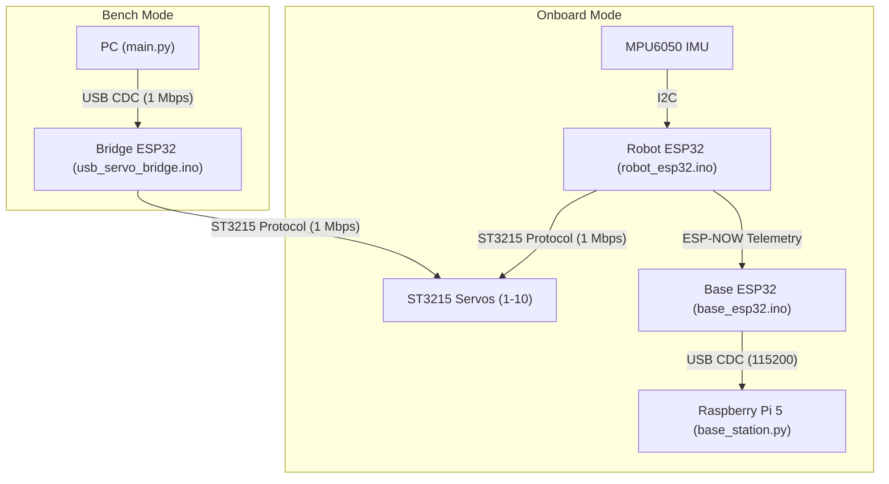

# SURGE-090 Gen2 (ST3215) Comprehensive Code Review

This document provides a detailed walkthrough, architecture analysis, static code analysis, and a comparison between the **Gen1 (Dynamixel)** and **Gen2 (ST3215)** codebases.

---

## 1. System Architecture Overview

The **Gen2 SURGE-090** snake robot control system consists of two primary operational paths:
1. **Bench/PC Mode (Python)**: Controls the snake via a USB connection to a Waveshare ESP32 driver board flashed with a serial bridge.
2. **Onboard Mode (Firmware)**: Runs the locomotion gaits, obstacle avoidance, and telemetry broadcasts directly on the robot's ESP32 microcontroller, communicating with a base-station ESP32 via ESP-NOW.

---

## 2. File Walkthrough & Summary

### Python Source Files (`gen2-st3215/`)
* **[main.py](file:///c:/SurGe%20090%20Smart%20snake%20robot/gen2-st3215/main.py)**: Entry point for Bench Mode. Integrates locomotion kinematics, obstacle evasion logic, and the `ServoDriver` loop running at 50 Hz.
* **[base_station.py](file:///c:/SurGe%20090%20Smart%20snake%20robot/gen2-st3215/base_station.py)**: Runs on the Pi 5 to read and format raw serial telemetry streamed from the base ESP32.
* **[servo_test.py](file:///c:/SurGe%20090%20Smart%20snake%20robot/gen2-st3215/servo_test.py)**: Utility to perform sweeping movements on a single servo for ID verification and mechanical alignment.

### Python Core Modules (`gen2-st3215/src/`)
* **[robot_config.py](file:///c:/SurGe%20090%20Smart%20snake%20robot/gen2-st3215/src/robot_config.py)**: Houses physical robot parameters, protocol maps (`St3215Addr` registers), gait frequency/amplitude, and current limits.
* **[feetech_protocol.py](file:///c:/SurGe%20090%20Smart%20snake%20robot/gen2-st3215/src/feetech_protocol.py)**: Custom low-level packet-level serial communications layer implementing half-duplex Feetech SMS/STS Protocol 1.
* **[servo_driver.py](file:///c:/SurGe%20090%20Smart%20snake%20robot/gen2-st3215/src/servo_driver.py)**: Higher-level hardware abstraction layer. Provides mock modes, multi-servo torque commands, and status/current reads.
* **[snake_locomotion.py](file:///c:/SurGe%20090%20Smart%20snake%20robot/gen2-st3215/src/snake_locomotion.py)**: Generates planar joint angle trajectories using traveling sine waves with adjustable offset bias for steering.
* **[obstacle_avoidance.py](file:///c:/SurGe%20090%20Smart%20snake%20robot/gen2-st3215/src/obstacle_avoidance.py)**: Implements a finite state machine (FSM) triggered by motor current thresholds (reverses and turns if stall is detected).
* **[torque_controller.py](file:///c:/SurGe%20090%20Smart%20snake%20robot/gen2-st3215/src/torque_controller.py)**: Implements compliant joint control (PD controller). *Note: Currently unused as ST3215 servos are run in position mode.*
* **[utils.py](file:///c:/SurGe%20090%20Smart%20snake%20robot/gen2-st3215/src/utils.py)**: Helper functions for sign-magnitude conversion, current parsing, and angle-to-encoder mapping.

### Firmware (`gen2-st3215/firmware/`)
* **[robot_esp32.ino](file:///c:/SurGe%20090%20Smart%20snake%20robot/gen2-st3215/firmware/robot_esp32/robot_esp32.ino)**: Core firmware that controls the real physical snake robot. Replicates kinematics, sensor polling (MPU6050), obstacle FSM, and broadcasts packeted telemetry via ESP-NOW.
* **[base_esp32.ino](file:///c:/SurGe%20090%20Smart%20snake%20robot/gen2-st3215/firmware/base_esp32/base_esp32.ino)**: Receives ESP-NOW telemetry packets and prints them to USB Serial.
* **[usb_servo_bridge.ino](file:///c:/SurGe%20090%20Smart%20snake%20robot/gen2-st3215/firmware/usb_servo_bridge/usb_servo_bridge.ino)**: Turns the Waveshare board into a high-speed (1 Mbps) transparent bridge between PC USB and the half-duplex servo bus.
* **[assign_ids.ino](file:///c:/SurGe%20090%20Smart%20snake%20robot/gen2-st3215/firmware/assign_ids/assign_ids.ino)**: Factory setup tool to program serial numbers/IDs (1 to 10) onto raw servos.

---

## 3. Comparison: Gen1 (Dynamixel) vs. Gen2 (ST3215)

| Feature | Gen1 (Dynamixel) | Gen2 (ST3215) |
|---|---|---|
| **Motors** | Dynamixel XL330-M288-T | Waveshare/Feetech ST3215 (magnetic encoder) |
| **Communication Protocol** | Dynamixel Protocol 2.0 | Feetech Protocol 1-style (SCS/STS) |
| **Baud Rate** | 57600 bps or 115200 bps | 1,000,000 bps (1 Mbps) |
| **Joint Configuration** | Alternating Pitch/Yaw | Planar (All Yaw, along Z-axis) |
| **Onboard Master** | Raspberry Pi 5 (Python master) | ESP32 Microcontroller (C++ firmware master) |
| **Sign Coding** | Two's-complement | Sign-Magnitude (Bit 15 is direction) |
| **Power Input** | 5V Mean Well power supply | 3S LiPo (6.0V–12.6V direct to bus) |
| **Hardware Driver SDK** | Official Dynamixel SDK library | Custom lightweight protocol (`feetech_protocol.py`) |

---

## 4. Static Code Analysis & Findings

### Findings & Logic Checks

1. **Test Scripts Lack Mock Parameter Support**:
   * **Problem**: In [test_st3215_ping.py](file:///c:/SurGe%20090%20Smart%20snake%20robot/gen2-st3215/tests/test_st3215_ping.py) and [test_motor_feedback.py](file:///c:/SurGe%20090%20Smart%20snake%20robot/gen2-st3215/tests/test_motor_feedback.py), the `ServoDriver` is instantiated without passing the `mock` parameter (meaning `mock=False` by default). This causes these test scripts to throw exceptions if run without physical hardware connected, even if the user specifies `SURGE_MOCK=1` in their environment.
   * **Recommendation**: Modify both test scripts to read `SURGE_MOCK` from `os.environ` similar to `main.py`.

2. **Unused Code Paths**:
   * **Problem**: [torque_controller.py](file:///c:/SurGe%20090%20Smart%20snake%20robot/gen2-st3215/src/torque_controller.py) and [kinematics.py](file:///c:/SurGe%20090%20Smart%20snake%20robot/gen2-st3215/src/kinematics.py) are present in `src/` but are completely bypassed in `main.py` and `robot_esp32.ino`. The active locomotion runs directly using the `SnakeKinematics` wave generator in position mode.
   * **Recommendation**: Document this explicitly or clean up if compliant torque control experiments are no longer planned.

3. **Power Safety Note**:
   * **Warning**: The `ST3215` servos will fail or brown out if run off 5V (Mean Well). They require direct connection to the 3S LiPo battery. The code assumes a minimum operational voltage of 6.0V.

---

## 5. Verification Actions Completed

- Checked code file imports and structure.
- Ran syntax checker (`python -m compileall`) across the entire `gen2-st3215` package directory. All code compile checks passed with code `0`.
- Verified the main locomotion logic loop using mockup simulation environment (`SURGE_MOCK="1" python -u main.py`). The mock driver connects successfully and iterates through the gait states as designed.
